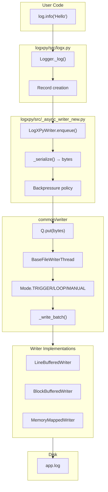

# Multi-Phase Plan: Integrate choose-L2 Writer into LogXPy

## Overview

This plan details the complete integration of the choose-L2 unified file writer library into the LogXPy ecosystem. The new writer provides:
- **3 I/O strategies**: LineBuffered, BlockBuffered (default), MemoryMapped
- **3 operational modes**: TRIGGER (event-driven), LOOP (periodic), MANUAL (explicit)
- **~550 lines total** vs ~2000+ lines in current AsyncWriter
- **No dependencies** (stdlib only)
- **Better performance**: 2.5-2.7M lines/second

---

## Phase 1: Generalize & Move to common/writer

### 1.1 Create Common Writer Module Structure

```
common/writer/
├── __init__.py              # Public API exports
├── base.py                  # BaseFileWriterThread, Mode, Q, QEmpty
├── README.md                # Module documentation
├── examples/                # Usage examples
│   ├── __init__.py
│   ├── basic_usage.py       # Basic examples
│   ├── performance_demo.py  # Benchmark demo
│   └── modes_comparison.py  # Mode comparison
└── tests/                   # Unit tests
    ├── __init__.py
    ├── conftest.py          # pytest fixtures
    ├── test_base.py         # Q, Mode tests
    ├── test_writers.py      # Writer implementation tests
    └── test_integration.py  # Integration tests
```

### 1.2 Adapt Code for Common Module

**Changes needed from choose-L2 to common/writer:**

| Aspect | choose-L2 | common/writer |
|--------|-----------|---------------|
| Package | `writer` | `common.writer` |
| Import path | `from writer import ...` | `from common.writer import ...` |
| Default writer | `BlockBufferedWriter` | `BlockBufferedWriter` (keep) |
| Q class | `deque[str]` | `deque[str \| bytes]` (support both) |
| Type hints | Basic | Full type hints with `__future__.annotations` |
| Docstrings | Basic | Google-style with Args/Returns/Raises |

### 1.3 Enhanced Base Classes

```python
# common/writer/base.py - Enhancements

# Support both str and bytes for Q
class Q:
    """Fast thread-safe queue supporting str and bytes."""
    __slots__ = ("_d", "_event", "_stopped")
    
    def put(self, data: str | bytes) -> None:
        """Add item to queue."""
        self._d.append(data)
        ...
    
    def get(self, timeout: float | None = None) -> str | bytes | None:
        """Get item from queue."""
        ...

# Enhanced BaseFileWriterThread with callbacks
class BaseFileWriterThread(ABC):
    """Abstract base with optional callbacks for metrics integration."""
    
    def __init__(
        self,
        q: Q,
        path: str | Path,
        mode: Mode = Mode.TRIGGER,
        *,
        on_write: Callable[[int], None] | None = None,  # Callback: lines written
        on_flush: Callable[[], None] | None = None,      # Callback: flush occurred
        ...
    ) -> None:
        ...
```

### 1.4 Create Module README

```markdown
# common/writer - Unified File Writer

High-performance file writer with 3 I/O strategies and 3 operational modes.

## Quick Start

```python
from common.writer import FileWriter, Mode, Q

q = Q()
writer = FileWriter(q, "app.log", Mode.TRIGGER)

for i in range(100000):
    writer.send(f"log line {i}")

q.stop()
writer.join()
```

## Writers

| Writer | Buffer | Best For |
|--------|--------|----------|
| LineBufferedWriter | 1 line | Real-time logging |
| BlockBufferedWriter | 64KB | **Default** - balanced |
| MemoryMappedWriter | OS-managed | Maximum throughput |

## Modes

| Mode | Behavior |
|------|----------|
| TRIGGER | Wake on each `send()` |
| LOOP | Poll every `tick` seconds |
| MANUAL | Write only on `trigger()` |
```

### 1.5 Phase 1 Tasks

- [ ] Create `common/writer/` directory structure
- [ ] Copy and adapt `base.py` with enhanced type hints
- [ ] Copy and adapt three writer implementations
- [ ] Create comprehensive `README.md`
- [ ] Create `examples/basic_usage.py`
- [ ] Create `examples/performance_demo.py`
- [ ] Create `examples/modes_comparison.py`
- [ ] Create `tests/conftest.py` with fixtures
- [ ] Create `tests/test_base.py` (Q, Mode tests)
- [ ] Create `tests/test_writers.py` (implementation tests)
- [ ] Create `tests/test_integration.py` (end-to-end tests)
- [ ] Add exports to `common/__init__.py`
- [ ] Run tests: `python -m pytest common/writer/tests/ -v`

---

## Phase 2: Replace logxpy's AsyncWriter

### 2.1 Current Architecture Analysis

```python
# Current logxpy/src/_async_writer.py - Key components:
- AsyncWriter class (main writer)
- AsyncConfig (configuration)
- AsyncMetrics (performance metrics)
- QueuePolicy enum (BLOCK, DROP_OLDEST, DROP_NEWEST, WARN)
- _writer_loop() (background thread)
- _flush_batch() (write to destinations)
```

### 2.2 New Architecture Design

```python
# logxpy/src/_async_writer_new.py - Integration layer:

from common.writer import (
    BaseFileWriterThread,
    BlockBufferedWriter as FileWriter,
    Mode,
    Q,
)

class LogXPyWriter:
    """LogXPy-compatible wrapper around common.writer.
    
    Maintains backward compatibility with existing API:
    - AsyncConfig → same interface
    - AsyncMetrics → enhanced with callbacks
    - QueuePolicy → mapped to Mode + error handling
    """
    
    def __init__(self, config: AsyncConfig | None = None):
        self._config = config or AsyncConfig()
        self._metrics = AsyncMetrics()
        self._q = Q()
        
        # Map QueuePolicy to Mode + handler
        self._writer = self._create_writer()
    
    def _create_writer(self) -> BaseFileWriterThread:
        """Create appropriate writer based on config."""
        # Map QueuePolicy.BLOCK → Mode.TRIGGER (default)
        # Map QueuePolicy.DROP_* → Mode.TRIGGER + custom handler
        
        mode = Mode.TRIGGER  # Default for backpressure=BLOCK
        
        # Use BlockBufferedWriter (64KB buffer) as default
        return FileWriter(
            self._q,
            self._path,
            mode=mode,
            on_write=self._on_write_callback,
            on_flush=self._on_flush_callback,
        )
    
    def enqueue(self, record: Record) -> bool:
        """Backward-compatible enqueue."""
        # Apply QueuePolicy logic before enqueue
        if self._config.queue_policy == QueuePolicy.BLOCK:
            self._q.put(serialized_data)
            self._metrics.record_enqueued()
            return True
        elif self._config.queue_policy == QueuePolicy.DROP_NEWEST:
            if self._q.qsize() >= self._config.max_queue_size:
                self._metrics.record_dropped()
                return False
            self._q.put(serialized_data)
            return True
        # ... etc
```

### 2.3 Mode Mapping

| Old QueuePolicy | New Mode | Behavior |
|-----------------|----------|----------|
| `BLOCK` | `TRIGGER` | Block on full queue (default) |
| `DROP_OLDEST` | `TRIGGER` + custom | Drop oldest if full |
| `DROP_NEWEST` | `TRIGGER` + custom | Skip if full |
| `WARN` | `TRIGGER` + custom | Warn + skip if full |

### 2.4 Serialization Integration

```python
# Keep existing serialization in caller thread
# logxpy/src/_async_writer_new.py

def enqueue(self, record: Record) -> bool:
    """Enqueue with pre-serialization (same as current)."""
    # Pre-serialize in caller thread (CPU work moved out of writer)
    data = self._serialize(record)  # Reuse existing _serialize
    
    # Apply policy
    if not self._apply_backpressure_policy(data):
        return False
    
    # Enqueue bytes
    self._q.put(data)
    self._metrics.record_enqueued()
    return True

def _serialize(self, record: Record) -> bytes:
    """Reuse existing serialization logic."""
    # Same as current _async_writer.py:439-457
    to_dict = record.to_dict
    dumps = _dumps_bytes
    default = json_default
    data = to_dict()
    return dumps(data, default=default) + b"\n"
```

### 2.5 Destination Integration

```python
# Support existing destination interface
# logxpy/src/_async_destinations.py integration

class AsyncFileDestination:
    """Wrap common.writer for destination compatibility."""
    
    def __init__(self, path: PathLike, ...):
        self._q = Q()
        self._writer = FileWriter(self._q, path, Mode.TRIGGER)
    
    def write(self, data: SerializedLog) -> None:
        """Compatible with existing interface."""
        self._q.put(data)
    
    def write_batch(self, batch: LogBatch) -> None:
        """Batch write for efficiency."""
        for item in batch:
            self._q.put(item)
```

### 2.6 Phase 2 Tasks

- [ ] Create `logxpy/src/_async_writer_new.py` integration layer
- [ ] Implement `LogXPyWriter` class with backward-compatible API
- [ ] Map `QueuePolicy` to new Mode + handlers
- [ ] Integrate existing `AsyncMetrics` with callbacks
- [ ] Integrate existing `AsyncConfig` options
- [ ] Support existing destination interface (`AsyncFileDestination`)
- [ ] Add serialization in caller thread (reuse existing)
- [ ] Create `logxpy/src/_async_writer_compat.py` for migration
- [ ] Test backward compatibility with existing tests
- [ ] Benchmark: compare old vs new performance
- [ ] Update `logxpy/src/__init__.py` exports if needed

---

## Phase 3: Update Documentation

### 3.1 Files to Update

| File | Updates |
|------|---------|
| `docs/LOGGING_FLOW_SEQUENCE_DIAGRAMS.md` | Update flow charts to show new writer architecture |
| `docs/FLUSH_TECHNIQUES.md` | Add common/writer flush modes |
| `docs/PYTHON_312_FEATURES.md` | Reference new writer code examples |
| `README.md` | Update architecture section |
| `AGENTS.md` | Update component descriptions |
| `GUIDE.md` | Add writer usage guide |
| `common/writer/README.md` | New module documentation |

### 3.2 New Flow Chart for Documentation

```markdown
## New Async Writer Architecture


```

### 3.3 Phase 3 Tasks

- [ ] Update `docs/LOGGING_FLOW_SEQUENCE_DIAGRAMS.md` with new architecture
- [ ] Update `docs/FLUSH_TECHNIQUES.md` with Mode explanation
- [ ] Create `docs/WRITER_MIGRATION.md` migration guide
- [ ] Update `README.md` architecture section
- [ ] Update `AGENTS.md` with new writer info
- [ ] Create comprehensive `common/writer/README.md`
- [ ] Add docstrings to all public APIs
- [ ] Verify all code examples work

---

## Phase 4: Update Tests

### 4.1 Test Strategy

```
Phase 4 Test Structure:
├── common/writer/tests/           # New writer tests (Phase 1)
│   ├── test_base.py               # Q, Mode, QEmpty tests
│   ├── test_writers.py            # Three writer implementations
│   └── test_integration.py        # End-to-end scenarios
├── logxpy/tests/                  # Existing tests (update)
│   ├── test_async_writer_new.py   # New integration tests
│   └── test_async_writer_compat.py # Backward compatibility
└── integration_tests/             # Cross-module tests
    └── test_full_pipeline.py      # End-to-end logging pipeline
```

### 4.2 Test Updates for Existing Tests

**Current test file:** `logxpy/tests/test_async_writer.py` (if exists)
**Or create:** `logxpy/tests/test_async_writer_integration.py`

```python
# Test backward compatibility
class TestAsyncWriterCompatibility:
    """Ensure new writer maintains backward compatibility."""
    
    def test_enqueue_returns_bool(self):
        """enqueue() still returns bool."""
        writer = LogXPyWriter()
        result = writer.enqueue(record)
        assert isinstance(result, bool)
    
    def test_metrics_preserved(self):
        """AsyncMetrics interface unchanged."""
        writer = LogXPyWriter()
        # Same metrics API
        assert writer.get_metrics()['enqueued'] >= 0
    
    def test_config_options_preserved(self):
        """AsyncConfig options still work."""
        config = AsyncConfig(
            max_queue_size=5000,
            batch_size=50,
            flush_interval_ms=50.0,
        )
        writer = LogXPyWriter(config)
        # All options respected
```

### 4.3 Phase 4 Tasks

- [ ] Create `common/writer/tests/conftest.py` with fixtures
- [ ] Create `common/writer/tests/test_base.py` (Q, Mode)
- [ ] Create `common/writer/tests/test_writers.py` (3 writers)
- [ ] Create `common/writer/tests/test_integration.py`
- [ ] Create `logxpy/tests/test_async_writer_new.py`
- [ ] Create `logxpy/tests/test_async_writer_compat.py`
- [ ] Run full test suite: `python -m pytest logxpy/tests/ -v`
- [ ] Run common tests: `python -m pytest common/writer/tests/ -v`
- [ ] Performance regression tests
- [ ] Stress tests (100K+ messages)

---

## Phase 5: Update Examples

### 5.1 Example Updates

| Example File | Updates |
|--------------|---------|
| `examples/basic_logging.py` | May need minor updates |
| `examples/async_logging.py` | Show new writer modes |
| `examples/performance_comparison.py` | Compare 3 writers |
| `examples/mode_comparison.py` | TRIGGER vs LOOP vs MANUAL |
| New: `examples/writer_modes.py` | Demonstrate all modes |

### 5.2 New Example: Writer Modes

```python
# examples/writer_modes.py
"""Demonstrate all writer modes and strategies."""

from logxpy import log
from logxpy.writer import Mode, WriterType  # New exports

# Example 1: Default (BlockBuffered, TRIGGER mode)
log.init("app.log")

# Example 2: LineBuffered for real-time logging
log.init("app.log", writer_type=WriterType.LINE_BUFFERED)

# Example 3: MemoryMapped for max throughput
log.init("app.log", writer_type=WriterType.MEMORY_MAPPED)

# Example 4: LOOP mode for batch processing
log.init("app.log", mode=Mode.LOOP, tick=0.5)

# Example 5: MANUAL mode with explicit flush
log.init("app.log", mode=Mode.MANUAL)
log.info("message 1")
log.info("message 2")
log.trigger()  # Explicit flush
```

### 5.3 Phase 5 Tasks

- [ ] Review all examples in `examples/`
- [ ] Update examples that use async writer directly
- [ ] Create `examples/writer_modes.py`
- [ ] Create `examples/writer_performance.py`
- [ ] Create `examples/writer_comparison.py`
- [ ] Update `examples/README.md` with new examples
- [ ] Test all examples: `python examples/run_all.py`

---

## Phase 6: Migration & Rollout

### 6.1 Gradual Migration Strategy

```python
# logxpy/src/_async_writer.py
# Keep old implementation as fallback

USE_NEW_WRITER = os.environ.get("LOGXPY_NEW_WRITER", "1") == "1"

if USE_NEW_WRITER:
    from ._async_writer_new import AsyncWriter, AsyncConfig, AsyncMetrics
else:
    # Legacy implementation (keep for rollback)
    from ._async_writer_legacy import AsyncWriter, AsyncConfig, AsyncMetrics
```

### 6.2 Environment Variables for Testing

| Variable | Purpose |
|----------|---------|
| `LOGXPY_NEW_WRITER=1` | Use new writer (default after rollout) |
| `LOGXPY_NEW_WRITER=0` | Use legacy writer (rollback) |
| `LOGXPY_WRITER_TYPE=line` | Select writer type |
| `LOGXPY_WRITER_MODE=trigger` | Select operational mode |

### 6.3 Phase 6 Tasks

- [ ] Add feature flag `USE_NEW_WRITER`
- [ ] Create `logxpy/src/_async_writer_legacy.py` backup
- [ ] Test rollback capability
- [ ] Performance validation in production-like environment
- [ ] Monitor error rates during rollout
- [ ] Remove legacy code after stable period (2-4 weeks)

---

## Implementation Timeline

| Phase | Duration | Dependencies |
|-------|----------|--------------|
| Phase 1: Common Module | 2-3 days | None |
| Phase 2: Integration Layer | 3-4 days | Phase 1 |
| Phase 3: Documentation | 2-3 days | Phase 1, 2 |
| Phase 4: Tests | 2-3 days | Phase 1, 2 |
| Phase 5: Examples | 1-2 days | Phase 2 |
| Phase 6: Migration | 2-3 days | Phase 2, 4 |
| **Total** | **12-18 days** | |

---

## Success Criteria

1. ✅ All existing tests pass without modification (backward compatibility)
2. ✅ Performance meets or exceeds current (2.5M+ L/s)
3. ✅ Memory usage reduced (slots, simpler code)
4. ✅ Code coverage >90% for new writer module
5. ✅ Documentation complete with examples
6. ✅ Rollback capability verified

---

## Risk Mitigation

| Risk | Mitigation |
|------|------------|
| Breaking changes | Maintain backward-compatible API layer |
| Performance regression | Benchmark before/after, keep legacy as fallback |
| Memory issues | Use `__slots__`, profile memory usage |
| Threading bugs | Extensive concurrency testing |
| Platform compatibility | Test on Linux, macOS, Windows |

---

## Appendix: API Comparison

### Current API (Backward Compatible)

```python
from logxpy import log, AsyncConfig, QueuePolicy

config = AsyncConfig(
    max_queue_size=10000,
    batch_size=100,
    flush_interval_ms=100.0,
    queue_policy=QueuePolicy.BLOCK,
)

log.init("app.log", async_en=True)
log.info("Hello, World!")
```

### New Extended API (Optional)

```python
from logxpy import log
from logxpy.writer import Mode, WriterType

# New options (optional, backward compatible)
log.init(
    "app.log",
    writer_type=WriterType.BLOCK_BUFFERED,  # or LINE_BUFFERED, MEMORY_MAPPED
    mode=Mode.TRIGGER,                       # or LOOP, MANUAL
    tick=0.1,                               # For LOOP mode
)
```
