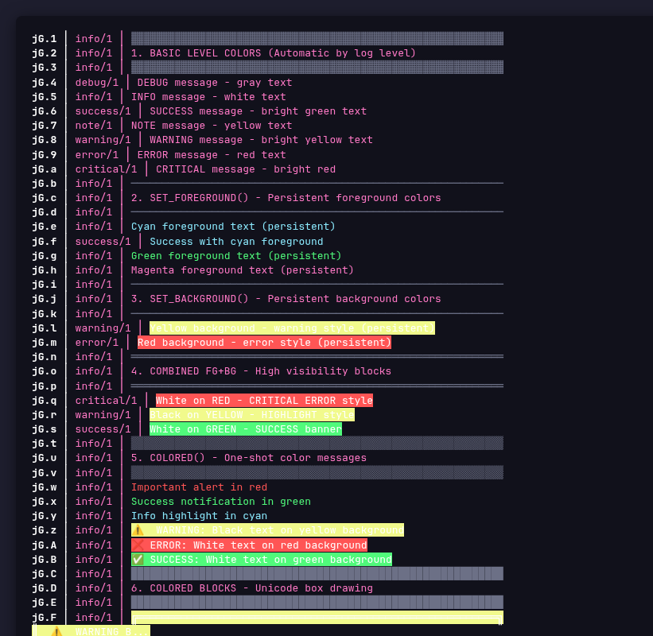
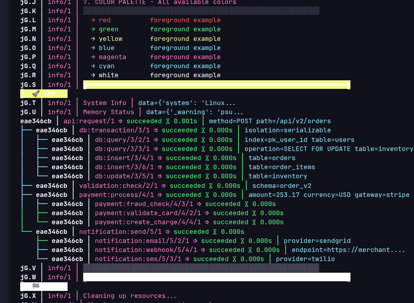

# log-x-py

Modern structured logging ecosystem with three components: logging library, tree viewer, and log parser.

> **📁 Complete API Reference**: [logxpy-api-reference.html](./logxpy-api-reference.html) - Full API docs with examples
>
> **📘 CodeSite Migration Guide**: [DOC-X/cross-docs/cross-lib1.html](./DOC-X/cross-docs/cross-lib1.html) - CodeSite vs logxpy cross-reference

---

## Component 1: logxpy - Logging Library

**Structured logging library with Sqid task IDs, fluent API, and minimal dependencies**


### Features
- **Type Safe** - Full type hints with Python 3.12+ syntax
- **Fast** - Dataclasses with slots (-40% memory), pattern matching (+10% speed)
- **Minimal Dependencies** - Uses boltons & more-itertools (pure Python)
- **Fluent API** - All methods return self for method chaining
- **Sqid Task IDs** - 89% smaller than UUID4 (4-12 chars vs 36)
- **Compact Field Names** - 1-2 character field names minimize log size
- **Nested Actions** - Track hierarchical operations with context
- **Status Tracking** - Automatic start/success/failed tracking
- **Color Support** - Foreground/background colors for CLI viewer rendering

### Quick Start
```bash
pip install logxpy
```

```python
from logxpy import start_action, Message, to_file

to_file(open("app.log", "w"))

with start_action(action_type="http:request", method="POST", path="/api/users"):
    with start_action(action_type="database:query", table="users"):
        Message.log(message_type="database:result", rows=10)
```

### Sqid Task IDs

LogXPy uses **Sqids** - ultra-short hierarchical task IDs that are 89% smaller than UUID4:

| Format | Example | Length | Use Case |
|--------|---------|--------|----------|
| Root | `"Xa.1"` | 4 chars | Top-level task |
| Child | `"Xa.1.1"` | 6 chars | Nested action |
| Deep | `"Xa.1.1.2"` | 8 chars | 3 levels deep |
| UUID4 (legacy) | `"59b00749-eb24-..."` | 36 chars | Distributed mode |

**Benefits:**
- Human-readable hierarchy (dots show depth)
- Process-isolated (PID prefix prevents collisions)
- 238K entries per process before wrap

**Force UUID4 for distributed systems:**
```bash
export LOGXPY_DISTRIBUTED=1
```

### Compact Field Names

LogXPy uses **1-2 character field names** to minimize log size:

| Compact | Legacy | Meaning |
|---------|--------|---------|
| `ts` | `timestamp` | Unix timestamp (seconds) |
| `tid` | `task_uuid` | Task ID (Sqid format) |
| `lvl` | `task_level` | Hierarchy level array |
| `mt` | `message_type` | Log level (info, success, error) |
| `at` | `action_type` | Action type (for emoji) |
| `st` | `action_status` | started/succeeded/failed |
| `dur` | `duration` | Duration in seconds |
| `msg` | `message` | Log message text |

**Using compact field constants:**
```python
from logxpy import TS, TID, LVL, MT, AT, ST, DUR, MSG

entry = {
    TS: time.time(),
    TID: sqid(),
    LVL: [1],
    MT: "info",
    MSG: "Hello, World!"
}
```

### Core API

> 📋 **Full API Reference**: See [logxpy-api-reference.html](./logxpy-api-reference.html) for complete documentation with all methods, parameters, and examples.

| Function | Purpose | Example |
|----------|---------|---------|
| `Message.log(**fields)` | Log structured message | `Message.log(info="starting", count=5)` |
| `start_action(action_type, **fields)` | Begin hierarchical action | `with start_action("db_query", table="users"):` |
| `start_task(action_type, **fields)` | Create top-level action | `with start_task("process"):` |
| `log(message_type, **fields)` | Log in current action | `log(message_type="event", x=1)` |
| `to_file(output_file)` | Set log output file | `to_file(open("app.log", "w"))` |
| `current_action()` | Get current action context | `action = current_action()` |
| `write_traceback()` | Log exception traceback | `except: write_traceback()` |

### LoggerX - Fluent API

LoggerX provides a **fluent API** where all methods return `self` for method chaining:

```python
from logxpy import log

# Method chaining
log.debug("starting").info("processing").success("done")

# All level methods return self
log.set_foreground("cyan").info("Cyan text").reset_foreground()
```

### LoggerX Level Methods

All level methods return `self` for chaining:

| Method | Level | Example |
|--------|-------|---------|
| `log.debug(msg, **fields)` | DEBUG | `log.debug("starting", count=5)` |
| `log.info(msg, **fields)` | INFO | `log.info("user login", user="alice")` |
| `log.success(msg, **fields)` | SUCCESS | `log.success("completed", total=100)` |
| `log.note(msg, **fields)` | NOTE | `log.note("checkpoint", step=3)` |
| `log.warning(msg, **fields)` | WARNING | `log.warning("slow query", ms=5000)` |
| `log.error(msg, **fields)` | ERROR | `log.error("failed", code=500)` |
| `log.critical(msg, **fields)` | CRITICAL | `log.critical("system down")` |
| `log.checkpoint(msg, **fields)` | CHECKPOINT (📍 prefix) | `log.checkpoint("step1")` |
| `log.exception(msg, **fields)` | ERROR + traceback | `except: log.exception("error")` |

### LoggerX Flexible __call__

The `log()` callable provides flexible shortcuts:

| Usage | Equivalent To | Example |
|-------|---------------|---------|
| `log("msg")` | `log.info("msg")` | `log("Starting")` |
| `log("title", data)` | `log.info("title", value=data)` | `log("User", {"id": 1})` |
| `log(data)` | `log.send("Data:Type", data)` | `log({"key": "val"})` |

### LoggerX Data Type Methods

| Method | Purpose | Example |
|--------|---------|---------|
| `log.color(value, title)` | Log RGB/hex colors | `log.color((255, 0, 0), "Theme")` |
| `log.currency(amount, code)` | Log currency with precision | `log.currency("19.99", "USD")` |
| `log.datetime(dt, title)` | Log datetime in multiple formats | `log.datetime(dt, "StartTime")` |
| `log.enum(enum_value, title)` | Log enum with name/value | `log.enum(Status.ACTIVE)` |
| `log.ptr(obj, title)` | Log object identity | `log.ptr(my_object)` |
| `log.variant(value, title)` | Log any value with type info | `log.variant(data, "Input")` |
| `log.sset(s, title)` | Log set/frozenset | `log.sset({1, 2, 3}, "Tags")` |
| `log.df(data, title)` | Log DataFrame | `log.df(df, "Results")` |
| `log.tensor(data, title)` | Log Tensor | `log.tensor(tensor, "Weights")` |
| `log.json(data, title)` | Log JSON with formatted output | `log.json({"key": "val"}, "Config")` |
| `log.img(data, title)` | Log Image | `log.img(image, "Screenshot")` |
| `log.plot(fig, title)` | Log Plot/Figure | `log.plot(fig, "Chart")` |
| `log.tree(data, title)` | Log tree structure | `log.tree(data, "Hierarchy")` |
| `log.table(data, title)` | Log table (list of dicts) | `log.table(rows, "Users")` |
| `log.system_info()` | Log OS/platform info | `log.system_info()` |
| `log.memory_status()` | Log memory statistics | `log.memory_status()` |
| `log.memory_hex(data)` | Log bytes as hex dump | `log.memory_hex(buffer)` |
| `log.stack_trace(limit)` | Log current call stack | `log.stack_trace(limit=10)` |
| `log.file_hex(path)` | Log file as hex dump | `log.file_hex("data.bin")` |
| `log.file_text(path)` | Log text file contents | `log.file_text("app.log")` |
| `log.stream_hex(stream)` | Log binary stream as hex | `log.stream_hex(bio)` |
| `log.stream_text(stream)` | Log text stream contents | `log.stream_text(io)` |

### LoggerX Context Management

| Method | Purpose | Example |
|--------|---------|---------|
| `log.scope(**ctx)` | Nested scope context manager | `with log.scope(user_id=123):` |
| `log.ctx(**ctx)` | Add context (returns new logger) | `log.ctx(user_id=123).info("...")` |
| `log.new(name)` | Create child logger | `child_log = log.new("database")` |

**Example:**
```python
from logxpy import log

# Context manager for nested scope
with log.scope(user_id=123, request_id="abc"):
    log.info("Processing request")  # Includes user_id and request_id

# Fluent context addition
log.ctx(user_id=123).info("User logged in")

# Create child logger
db_log = log.new("database")
db_log.info("Query executed")  # Shows "root.database" as logger name
```

### LoggerX Initialization

```python
from logxpy import log

# Auto-generate log filename from caller script (e.g., script.py -> script.log)
log.init()

# Specify file
log.init("app.log")

# With level and mode
log.init("app.log", level="INFO", mode="w")

# Full configuration
log.configure(
    level="DEBUG",
    destinations=["console", "file://app.log"],
    format="rich",
    mask_fields=["password", "token"]
)
```

### Color and Style Methods (for CLI Viewer)

These methods create **colored blocks or lines** when viewed with logxpy-cli-view:



> 📁 **Source**: [`examples-log-view/3level-nested-colored/xxx_3level_nested_colored.py`](examples-log-view/3level-nested-colored/xxx_3level_nested_colored.py)

| Method | Purpose | Example |
|--------|---------|---------|
| `log.set_foreground(color)` | Set foreground color | `log.set_foreground("cyan")` |
| `log.set_background(color)` | Set background color | `log.set_background("yellow")` |
| `log.reset_foreground()` | Reset foreground color | `log.reset_foreground()` |
| `log.reset_background()` | Reset background color | `log.reset_background()` |
| `log.colored(msg, fg, bg)` | One-shot colored message | `log.colored("Important!", "red", "yellow")` |

**Available colors**: black, red, green, yellow, blue, magenta, cyan, white, light_gray, dark_gray, light_red, light_green, light_blue, light_yellow, light_magenta, light_cyan

**Example: Creating colored blocks**
```python
from logxpy import log

# Set colors for subsequent messages
log.set_foreground("cyan")
log.info("This renders with cyan text")
log.reset_foreground()

# One-shot colored message for highlighted blocks
log.colored(
    "╔════════════════════════════════════╗\n"
    "║  ⚠️  IMPORTANT HIGHLIGHTED BLOCK  ║\n"
    "╚════════════════════════════════════╝",
    foreground="black",
    background="yellow"
)
```

### OpenTelemetry Integration

```python
from logxpy import log

# OpenTelemetry span context manager
with log.span("database_query", table="users", sql="SELECT *"):
    # Your code here
    results = db.query("SELECT * FROM users")
```

### Decorators

| Decorator | Purpose | Example |
|-----------|---------|---------|
| `@logged(level, ...)` | Universal logging decorator | `@logged(level="DEBUG")` |
| `@timed(metric)` | Timing-only decorator | `@timed("db.query")` |
| `@retry(attempts, delay)` | Retry with backoff | `@retry(attempts=5)` |
| `@generator` | Generator logging | `@generator` |
| `@aiterator` | Async iterator logging | `@aiterator` |
| `@trace` | Tracing decorator | `@trace` |
| `@log_call(action_type)` | Log function calls | `@log_call(action_type="func")` |

### Category System

| Class/Function | Purpose | Example |
|----------------|---------|---------|
| `CategorizedLogger` | Logger with category prefix | `cat_log = CategorizedLogger("database")` |
| `category_context(name)` | Context manager for category | `with category_context("db"):` |
| `Category(name)` | Global category manager | `Category("database")` |
| `log.with_category(name)` | Create categorized logger | `db_log = log.with_category("database")` |

### System Message Types

| Message Type | Purpose |
|--------------|---------|
| `logxpy:traceback` | Exception traceback logging |
| `loggerx:debug` | Debug level messages |
| `loggerx:info` | Info level messages |
| `loggerx:success` | Success level messages |
| `loggerx:warning` | Warning level messages |
| `loggerx:error` | Error level messages |
| `loggerx:critical` | Critical level messages |

---

## Component 2: logxpy-cli-view - Colored Tree Viewer

**Render LogXPy logs as a beautiful colored ASCII tree with powerful filtering and statistics**


### Features
- **ANSI Colors** - Color-coded values (numbers: cyan, booleans: magenta, errors: red)
- **Emoji Icons** - Visual indicators for action types (💾 database, 🔌 API, 🔐 auth)
- **Tree Structure** - Unicode box-drawing characters (├── └── │)
- **Color Block Rendering** - Supports `logxpy:foreground` and `logxpy:background` fields
- **Powerful Filtering** - JMESPath queries, date ranges, duration filters, keyword search
- **Statistics** - Success/failure rates, duration stats, action type counts
- **Live Monitoring** - Tail mode with real-time updates and dashboard
- **Pattern Extraction** - Extract emails, IPs, URLs from logs
- **Export** - JSON, CSV, HTML, logfmt formats



> 📁 **Source**: [`examples-log-view/3level-nested-colored/xxx_3level_nested_colored.py`](examples-log-view/3level-nested-colored/xxx_3level_nested_colored.py)

### Quick Start
```bash
# View logs with full colors
logxpy-view app.log

# Or use the standalone script
python examples-log-view/view_tree.py app.log
```

### CLI Commands

```bash
# Main command (render) - default
logxpy-view app.log

# Statistics
logxpy-view stats app.log

# Export
logxpy-view export app.log -f json -o output.json

# Live monitoring (tail)
logxpy-view tail app.log
```

### CLI Options

#### Filtering Options
| Option | Description |
|--------|-------------|
| `--task-uuid <uuid>` | Filter by task UUID (Sqid) |
| `--select <jmespath>` | JMESPath query (multiple allowed) |
| `--start <date>` | Filter after ISO8601 date |
| `--end <date>` | Filter before ISO8601 date |
| `--status <status>` | Filter by action status (started/succeeded/failed) |
| `--action-type <pattern>` | Filter by action type (supports wildcards) |
| `--action-type-regex` | Treat action-type as regex pattern |
| `--min-duration <seconds>` | Filter by minimum duration |
| `--max-duration <seconds>` | Filter by maximum duration |
| `--has-field <name>` | Filter by field existence |
| `--keyword <text>` | Search in all field values |
| `--min-level <n>` | Filter by minimum task level (depth) |
| `--max-level <n>` | Filter by maximum task level (depth) |

#### Output Options
| Option | Description |
|--------|-------------|
| `--format tree\|oneline` | Output format (default: tree) |
| `--theme auto\|dark\|light` | Color theme (default: auto) |
| `--field-limit <n>` | Limit field value length |
| `--no-line-numbers` | Hide line numbers |
| `--no-color-tree` | Disable tree line coloring |
| `--ascii` | Use ASCII characters instead of Unicode |
| `--no-emojis` | Remove emoji icons |
| `--no-colors` | Disable all colors |

#### Statistics Options
| Option | Description |
|--------|-------------|
| `-o, --output <file>` | Export statistics to JSON file |

#### Export Options
| Option | Description |
|--------|-------------|
| `-f, --format json\|csv\|html\|logfmt` | Export format |
| `-o, --output <file>` | Output file path (required) |
| `--indent <n>` | JSON indentation level |
| `--include-fields <fields>` | Fields to include |
| `--exclude-fields <fields>` | Fields to exclude |
| `--title <title>` | HTML page title |

#### Tail/Monitoring Options
| Option | Description |
|--------|-------------|
| `-n, --lines <n>` | Initial lines to show (default: 10) |
| `--no-follow` | Don't follow file |
| `-d, --dashboard` | Show live dashboard |
| `-a, --aggregate` | Show periodic statistics |
| `-i, --interval <seconds>` | Aggregation interval |
| `-r, --refresh <ms>` | Dashboard refresh rate |

### Python API

#### Core Functions
| Function | Purpose | Example |
|----------|---------|---------|
| `tasks_from_iterable(lines)` | Parse log lines | `tasks = tasks_from_iterable(f)` |
| `render_tasks(tasks)` | Render as tree | `print(render_tasks(tasks))` |
| `render_oneline(tasks)` | Render one-line format | `print(render_oneline(tasks))` |

#### Filter Functions
| Function | Purpose | Example |
|----------|---------|---------|
| `filter_by_action_status(tasks, status)` | Filter by status | `filter_by_action_status(tasks, "failed")` |
| `filter_by_action_type(tasks, pattern)` | Filter by action name | `filter_by_action_type(tasks, "db_*")` |
| `filter_by_duration(tasks, min, max)` | Filter by duration | `filter_by_duration(tasks, 1.0)` |
| `filter_by_keyword(tasks, keyword)` | Search values | `filter_by_keyword(tasks, "error")` |
| `filter_by_jmespath(tasks, query)` | JMESPath query | `filter_by_jmespath(tasks, "[?level=='error']")` |
| `filter_by_uuid(tasks, *uuids)` | Filter by task UUID | `filter_by_uuid(tasks, "Xa.1")` |
| `filter_by_start_date(tasks, date)` | Filter by start date | `filter_by_start_date(tasks, "2024-01-01")` |
| `filter_by_end_date(tasks, date)` | Filter by end date | `filter_by_end_date(tasks, "2024-12-31")` |
| `filter_by_field_exists(tasks, field)` | Filter by field existence | `filter_by_field_exists(tasks, "error")` |

#### Export Functions
| Function | Purpose | Example |
|----------|---------|---------|
| `export_json(tasks, file)` | Export as JSON | `export_json(tasks, "out.json")` |
| `export_csv(tasks, file)` | Export as CSV | `export_csv(tasks, "out.csv")` |
| `export_html(tasks, file)` | Export as HTML | `export_html(tasks, "out.html")` |
| `export_logfmt(tasks, file)` | Export as logfmt | `export_logfmt(tasks, "out.log")` |

#### Statistics Functions
| Function | Purpose | Example |
|----------|---------|---------|
| `calculate_statistics(tasks)` | Calculate statistics | `stats = calculate_statistics(tasks)` |
| `print_statistics(stats)` | Print formatted stats | `print_statistics(stats)` |
| `create_time_series(tasks)` | Create time series data | `ts = create_time_series(tasks)` |

**Example:**
```python
from logxpy_cli_view import tasks_from_iterable, calculate_statistics

tasks = tasks_from_iterable(open("app.log"))
stats = calculate_statistics(tasks)

print(f"Total tasks: {stats.total_tasks}")
print(f"Success rate: {stats.success_rate:.1%}")
print(f"Failed actions: {stats.failed_count}")
```

#### Pattern Extraction
| Function | Purpose | Example |
|----------|---------|---------|
| `extract_emails(entries)` | Extract email addresses | `emails = extract_emails(entries)` |
| `extract_ips(entries)` | Extract IP addresses | `ips = extract_ips(entries)` |
| `extract_urls(entries)` | Extract URLs | `urls = extract_urls(entries)` |
| `extract_uuids(entries)` | Extract UUIDs | `uuids = extract_uuids(entries)` |

#### Live Monitoring
| Function | Purpose | Example |
|----------|---------|---------|
| `tail_logs(path)` | Tail log file | `tail_logs("app.log")` |
| `LiveDashboard()` | Live dashboard class | `LiveDashboard().run()` |
| `watch_and_aggregate(path)` | Watch and aggregate | `watch_and_aggregate("app.log")` |

### Color System

**Supported Colors**:
- Foreground: red, green, blue, yellow, magenta, cyan, white, black, light_gray, dark_gray, light_red, light_green, light_blue, light_yellow, light_magenta, light_cyan
- Background: Same colors available
- Styles: bold, dim, underline, blink, reverse, hidden

**Level-based Colors**:
- DEBUG: Gray
- INFO: White
- SUCCESS: Bright Green
- NOTE: Yellow
- WARNING: Bright Yellow
- ERROR: Red
- CRITICAL: Bright Red with background

---

## Component 3: logxy-log-parser - Log Parser & Analyzer

**Python library for parsing, analyzing, and querying LogXPy log files with indexing and time-series analysis**


### Features
- **Simple One-Line API** - Parse entire files in one call
- **Indexing System** - Fast lookups for large log files
- **Powerful Filtering** - By level, time, action type, field values
- **Time Series Analysis** - Anomaly detection, heatmaps, burst detection
- **Aggregation** - Multi-file analysis and aggregation
- **Real-time Monitoring** - Watch logs as they grow
- **Export** - JSON, CSV, HTML, Markdown, DataFrame
- **CLI Tools** - Query, analyze, view, and visualize logs

### Quick Start
```bash
pip install logxy-log-parser
```

```python
from logxy_log_parser import parse_log, check_log, analyze_log

# One-line parsing
entries = parse_log("app.log")

# Parse + validate
result = check_log("app.log")
print(f"Valid: {result.is_valid}, Entries: {result.entry_count}")

# Full analysis
report = analyze_log("app.log")
report.print_summary()
```

### Simple One-Line API

| Function | Purpose | Returns |
|----------|---------|---------|
| `parse_log(source)` | Parse log file | `ParseResult` |
| `parse_line(line)` | Parse single line | `LogXPyEntry` or `None` |
| `check_log(source)` | Parse + validate | `CheckResult` |
| `analyze_log(source)` | Full analysis | `AnalysisReport` |

### Core Classes

| Class | Purpose |
|-------|---------|
| `LogFile` | File handle + real-time monitoring |
| `LogParser` | Parse log files |
| `LogEntries` | Collection with filtering/export |
| `LogFilter` | Chainable filters |
| `LogAnalyzer` | Performance/error analysis |
| `TaskTree` | Hierarchical task tree |
| `LogIndex` | Fast lookups via indexing |
| `IndexedLogParser` | Parser with index support |
| `TimeSeriesAnalyzer` | Time-series analysis |
| `LogAggregator` | Multi-file aggregation |
| `MultiFileAnalyzer` | Cross-file analysis |

### LogFile API (Real-time Monitoring)

| Method | Purpose | Example |
|--------|---------|---------|
| `LogFile.open(path)` | Open and validate | `logfile = LogFile.open("app.log")` |
| `logfile.entry_count` | Get entry count (fast) | `count = logfile.entry_count` |
| `logfile.contains_error()` | Check for errors | `if logfile.contains_error():` |
| `logfile.watch()` | Iterate new entries | `for entry in logfile.watch():` |
| `logfile.wait_for_message(text, timeout)` | Wait for message | `entry = logfile.wait_for_message("ready", 30)` |
| `logfile.wait_for_error(timeout)` | Wait for error | `error = logfile.wait_for_error(60)` |
| `logfile.contains(**criteria)` | Check contains | `logfile.contains(level="error")` |
| `logfile.find_first(**criteria)` | Find first match | `first = logfile.find_first(level="error")` |
| `logfile.find_all(**criteria)` | Find all matches | `all_errors = logfile.find_all(level="error")` |
| `logfile.tail(n)` | Get last N entries | `last = logfile.tail(10)` |

### LogFilter Methods

All filter methods return `LogEntries` for chaining:

| Method | Purpose | Example |
|--------|---------|---------|
| `by_level(*levels)` | Filter by log level | `.by_level("error", "warning")` |
| `by_message(pattern)` | Filter by message text | `.by_message("database")` |
| `by_time_range(start, end)` | Filter by time range | `.by_time_range("2024-01-01", "2024-12-31")` |
| `by_task_uuid(*uuids)` | Filter by task ID (Sqid) | `.by_task_uuid("Xa.1")` |
| `by_action_type(*types)` | Filter by action type | `.by_action_type("db:*")` |
| `by_field(field, value)` | Filter by field value | `.by_field("user_id", 123)` |
| `by_duration(min, max)` | Filter by duration | `.by_duration(min=1.0)` |
| `by_nesting_level(min, max)` | Filter by depth | `.by_nesting_level(1, 3)` |
| `with_traceback()` | Entries with tracebacks | `.with_traceback()` |
| `failed_actions()` | Failed actions only | `.failed_actions()` |
| `succeeded_actions()` | Succeeded actions only | `.succeeded_actions()` |
| `slow_actions(threshold)` | Slow actions only | `.slow_actions(5.0)` |
| `fast_actions(threshold)` | Fast actions only | `.fast_actions(0.001)` |

**Example:**
```python
from logxy_log_parser import LogParser, LogFilter

parser = LogParser("app.log")
logs = parser.parse()

# Chain filters
result = (LogFilter(logs)
    .by_level("error", "warning")
    .by_time_range("2024-01-01", "2024-12-31")
    .slow_actions(1.0))

result.to_html("slow_errors.html")
```

### LogAnalyzer Methods

| Method | Purpose | Returns |
|--------|---------|---------|
| `slowest_actions(n)` | Get slowest actions | `list[ActionStat]` |
| `fastest_actions(n)` | Get fastest actions | `list[ActionStat]` |
| `duration_by_action()` | Duration by action type | `dict[str, DurationStats]` |
| `error_summary()` | Error analysis summary | `ErrorSummary` |
| `error_patterns()` | Find error patterns | `list[ErrorPattern]` |
| `failure_rate_by_action()` | Failure rate per action | `dict[str, float]` |
| `deepest_nesting()` | Maximum nesting depth | `int` |
| `orphans()` | Unmatched entries | `LogEntries` |
| `timeline(interval)` | Timeline data | `Timeline` |
| `peak_periods(n)` | Busiest time periods | `list[TimePeriod]` |
| `generate_report(format)` | Generate report | `str` (html/text/json) |

### Indexing System

For fast lookups in large log files:

| Class/Method | Purpose | Example |
|--------------|---------|---------|
| `LogIndex.build(path)` | Build index | `index = LogIndex.build("app.log")` |
| `index.find_by_task(uuid)` | Find by task UUID | `index.find_by_task("Xa.1")` |
| `index.find_by_level(level)` | Find by level | `index.find_by_level("error")` |
| `index.find_by_time_range(start, end)` | Find by time range | `index.find_by_time_range(start, end)` |
| `IndexedLogParser(path)` | Indexed parser | `parser = IndexedLogParser("app.log")` |
| `parser.query(**criteria)` | Query with criteria | `parser.query(task_uuid="Xa.1")` |

**Example:**
```python
from logxy_log_parser import LogIndex, IndexedLogParser

# Build index for fast lookups
index = LogIndex.build("large_app.log")

# Query by task UUID
positions = index.find_by_task("Xa.1")

# Use indexed parser
parser = IndexedLogParser("large_app.log")
results = parser.query(task_uuid="Xa.1", level="error")
```

### Time Series Analysis

| Method | Purpose | Returns |
|--------|---------|---------|
| `bucket_by_interval(seconds)` | Bucket by time interval | `list[TimeBucket]` |
| `detect_anomalies(window, threshold)` | Detect anomalies | `list[Anomaly]` |
| `error_rate_t(interval)` | Error rate over time | `list[tuple]` |
| `level_distribution(interval)` | Level distribution | `dict` |
| `activity_heatmap(hour_granularity)` | Activity heatmap | `dict` |
| `burst_detection(threshold, min_interval)` | Detect bursts | `list[Burst]` |

**Example:**
```python
from logxy_log_parser import LogParser, TimeSeriesAnalyzer

parser = LogParser("app.log")
logs = parser.parse()

analyzer = TimeSeriesAnalyzer(logs)

# Detect anomalies
for anomaly in analyzer.detect_anomalies(window_size=10, threshold=2.0):
    print(f"Anomaly at {anomaly.timestamp}: {anomaly.description}")

# Activity heatmap
heatmap = analyzer.activity_heatmap()
for hour, count in heatmap.items():
    print(f"{hour}:00 - {count} entries")
```

### Aggregation & Multi-File Analysis

| Class/Method | Purpose | Example |
|--------------|---------|---------|
| `LogAggregator(files)` | Aggregate multiple files | `agg = LogAggregator(["f1.log", "f2.log"])` |
| `aggregator.aggregate()` | Aggregate all files | `result = agg.aggregate()` |
| `MultiFileAnalyzer(files)` | Analyze multiple files | `multi = MultiFileAnalyzer(files)` |
| `multi.analyze_all()` | Analyze all files | `multi.analyze_all()` |
| `multi.time_series_analysis(interval)` | Time series across files | `multi.time_series_analysis(3600)` |

### CLI Commands

#### logxy-query - Query log files
```bash
# Basic query
logxy-query app.log --level error --output errors.json

# Time range filter
logxy-query app.log --start "2024-01-01" --end "2024-12-31"

# Duration filter
logxy-query app.log --min-duration 1.0 --sort duration --limit 20

# Multiple filters
logxy-query app.log --level error --action-type "db:*" --failed
```

#### logxy-analyze - Analyze and generate reports
```bash
# Performance report
logxy-analyze app.log --slowest 20 --format html --output report.html

# Error analysis
logxy-analyze app.log --errors --format json --output errors.json

# Timeline analysis
logxy-analyze app.log --timeline --interval 1h

# Full analysis
logxy-analyze app.log --report performance --format html
```

#### logxy-view - View with colors
```bash
# View with level filter
logxy-view app.log --level error

# Follow mode (tail -f)
logxy-view app.log --follow

# Specific task
logxy-view app.log --task Xa.1
```

#### logxy-tree - Visualize task tree
```bash
# Show tree for specific task
logxy-tree app.log --task Xa.1

# ASCII format
logxy-tree app.log --format ascii
```

### Export Functions

| Method | Purpose |
|--------|---------|
| `to_json(file, pretty)` | Export as JSON |
| `to_csv(file, flatten)` | Export as CSV |
| `to_html(file, template)` | Export as HTML |
| `to_markdown(file)` | Export as Markdown |
| `to_dataframe()` | Export as pandas DataFrame |

---

## Installation

Install any or all components:

```bash
# Just the logging library (minimal dependencies)
pip install logxpy

# Just the tree viewer
pip install logxpy-cli-view

# Just the log parser
pip install logxy-log-parser

# All three (recommended)
pip install logxpy logxpy-cli-view logxy-log-parser
```

Or install from source:

```bash
# Library
cd logxpy && pip install -e .

# Viewer
cd logxpy_cli_view && pip install -e .

# Parser
cd logxy-log-parser && pip install -e .
```

---

## Live Output Example

**Terminal Output (with actual ANSI colors):**

```
Xa.1
├── 🔌 http:request/1 ⇒ ▶️ started 14:30:00
│   ├── method: POST
│   └── path: /api/users
├── 🔐 auth:verify/2/1 ⇒ ▶️ started 14:30:00
│   ├── user_id: 123
│   └── valid: True
├── 💾 database:query/3/1 ⇒ ▶️ started 14:30:00
│   ├── table: users
│   └── 💾 database:result/3/2 14:30:01
│   ├── rows: 10
│   └── duration_ms: 45
└── 🔌 http:request/4 ⇒ ✔️ succeeded 14:30:01
```

**Color Legend:**
- **Cyan** = Numbers
- **Magenta** = Booleans, Task IDs (Sqid)
- **Bright Blue** = Started status, Field keys
- **Bright Green** = Succeeded status
- **Bright Red** = Failed status

---

## Quick Start (Try It Now)

```bash
cd examples-log-view
python example_01_basic.py
logxpy-view example_01_basic.log
```

## Complete Cheat Sheet

| Feature | Syntax/Example | Description |
|---------|----------------|-------------|
| **Commands** | | |
| Basic view | `logxpy-view file.log` | Full color + emoji + Unicode |
| ASCII mode | `logxpy-view file.log --ascii` | Plain text, no Unicode/emoji |
| No colors | `logxpy-view file.log --no-colors` | Remove ANSI colors |
| No emojis | `logxpy-view file.log --no-emojis` | Remove emoji icons |
| Depth limit | `logxpy-view file.log --max-level 3` | Max nesting levels |
| Statistics | `logxpy-view stats file.log` | Show statistics |
| Export | `logxpy-view export file.log -f json -o out.json` | Export format |
| Tail/Follow | `logxpy-view tail file.log` | Live monitoring |
| Help | `logxpy-view --help` | Show all options |

---

## Project Structure

```
log-x-py/
├── logxpy/                          # Component 1: Core logging library
│   ├── logxpy/                      # Main package
│   ├── setup.py                     # Installation config
│   └── examples/                    # Library usage examples
│
├── logxpy_cli_view/                 # Component 2: CLI tree viewer
│   ├── src/logxpy_cli_view/         # Main package
│   ├── pyproject.toml               # Installation config
│   └── tests/                       # Test suite
│
├── logxy-log-parser/                # Component 3: Log parser & analyzer
│   ├── logxy_log_parser/            # Main package
│   ├── pyproject.toml               # Installation config
│   └── examples/                    # Usage examples
│
├── examples-log-view/               # Standalone examples (demo both packages)
│   ├── view_tree.py                # Simple tree viewer script
│   ├── example_01_basic.py         # Basic logging
│   ├── example_02_actions.py       # Nested actions
│   ├── example_03_errors.py        # Error handling
│   ├── example_04_api_server.py    # API simulation
│   ├── example_05_data_pipeline.py # ETL pipeline
│   ├── example_06_deep_nesting.py  # 7-level nesting
│   ├── example_07_all_data_types.py # All data types
│   └── run_all.sh                  # Run all examples
│
├── tutorials/                       # Detailed tutorials
├── README.md                        # This file
├── AGENTS.md                        # AI agent guide
├── PLAN_DOCUMENTATION_UPDATE.md     # Documentation update plan
└── PROJECT_SUMMARY.md               # Project overview
```

---

## Statistics

| Component | Lines | Dependencies | Python |
|-----------|-------|--------------|--------|
| **logxpy** (library) | ~2000 | 0 | 3.12+ |
| **logxpy-cli-view** (viewer) | ~1500 | 4 (jmespath, iso8601, colored, toolz) | 3.9+ |
| **logxy-log-parser** (parser) | ~2000 | 0 (optional: pandas, rich) | 3.12+ |

---

## Use Cases

**Development**: Debug nested operations, trace request flows, visualize errors
**Testing**: Verify log formats, test data types, validate structures
**Production**: Monitor performance, track errors, audit trails
**Documentation**: Generate examples, show API flows, training materials

---

## License

MIT License

---

## Credits & Attribution

This project is a fork and modernization of two excellent libraries:

### logxpy (Logging Library)
**Forked from [Eliot](https://github.com/itamarst/eliot)** by Itamar Turner-Trauring
- Original: Structured logging for complex & distributed systems
- Changes: Modernized for Python 3.12+, renamed to logxpy, enhanced API

### logxpy-cli-view (Tree Viewer)
**Forked from [eliottree](https://github.com/jonathanj/eliottree)** by Jonathan Jacobs
- Original: Render Eliot logs as ASCII trees
- Changes: Modernized codebase, renamed to logxpy-cli-view, added new features

### License
Both original projects are licensed under Apache 2.0. This fork maintains compatibility with the original Eliot log format while providing a modernized API and toolset.

---

**Python 3.12+ | Sqid Task IDs | Fluent API | Type Safe**
