# LogXPy Logging Flow - Complete Code-Level Flow Charts

This document contains detailed flow charts showing **actual code at every level** from `log.info("Hello, World!")` to the final file write.

---

## Table of Contents

1. [Overview: Complete Flow](#1-overview-complete-flow)
2. [Level 1: User API](#2-level-1-user-api)
3. [Level 2: Logger Methods](#3-level-2-logger-methods)
4. [Level 3: Record Creation](#4-level-3-record-creation)
5. [Level 4: Async Enqueue](#5-level-4-async-enqueue)
6. [Level 5: Writer Thread](#6-level-5-writer-thread)
7. [Level 6: File Write](#7-level-6-file-write)
8. [Sync Mode Fallback](#8-sync-mode-fallback)
9. [Sqid Generation Flow](#9-sqid-generation-flow)

---

## 1. Overview: Complete Flow

```mermaid
flowchart TB
    subgraph User["👤 User Code"]
        U1["log.info('Hello, World!')"]
    end

    subgraph Level1["📦 Level 1: logx.py"]
        L1["def info(msg, **f):<br/>return self._log(Level.INFO, msg, **f)"]
    end

    subgraph Level2["📦 Level 2: _log() Internal"]
        L2["Create Record object<br/>with task info + context"]
    end

    subgraph Level3["📦 Level 3: AsyncWriter"]
        L3["enqueue(record)<br/>→ serialize → queue.put()"]
    end

    subgraph Level4["📦 Level 4: Writer Thread"]
        L4["_writer_loop()<br/>batch → _flush_batch()"]
    end

    subgraph Level5["📦 Level 5: FileDestination"]
        L5["os.write(fd, data)<br/>O_APPEND | O_CLOEXEC"]
    end

    subgraph Disk["💾 Disk"]
        D1["app.log"]
    end

    U1 --> L1 --> L2 --> L3 --> L4 --> L5 --> D1
```



---

## 2. Level 1: User API

### 2.1 User Code Entry Point

```python
# examples/logxpy/01_simple_logging.py
from logxpy import log

# Initialize logging
log.init("app.log", level="INFO", async_en=True)

# ⬇️ THIS IS THE ENTRY POINT
log.info("Hello, World!")
```

### 2.2 Flow to Logger.info()


### 2.3 Code: Logger.info() → _log()

**File: `logxpy/src/logx.py:62-63`**

```python
def info(self, msg: str, **f: Any) -> Self:
    return self._log(Level.INFO, msg, **f)
```

**What happens:**
- `info()` receives `"Hello, World!"` as `msg`
- `**f` captures any extra fields (empty in this case)
- Returns `Self` for fluent chaining

---

## 3. Level 2: Logger._log() Internal

### 3.1 Flow Chart


### 3.2 Code: Logger._log() Full Implementation

**File: `logxpy/src/logx.py:871-903`**

```python
def _log(self, level: Level, msg: str, **fields: Any) -> Self:
    # 1. Level filtering check
    if level.value < self._level.value:
        return self

    # 2. Get current action context (for nested logging)
    act = current_action()
    task_uuid, task_level = _get_task_info(act)

    # 3. Merge context: global scope + logger instance context
    ctx = current_scope()
    if self._context:
        ctx = {**ctx, **self._context}

    # 4. Create immutable Record object
    record = Record(
        timestamp=now(),           # Unix timestamp (float)
        level=level,               # Level.INFO
        message=msg,               # "Hello, World!"
        message_type=level.name.lower(),  # "info"
        fields=fields,             # Extra fields ({})
        context=ctx,               # Merged context
        task_uuid=task_uuid,       # Sqid: "Xa.1"
        task_level=task_level,     # (1,) or nested
    )

    # 5. Route to async writer if enabled (default)
    if self._async_writer is not None:
        enqueued = self._async_writer.enqueue(record)
        if enqueued:
            return self
        # If enqueue failed (dropped), fall through to sync

    # 6. Sync path fallback
    _emit(record)
    return self
```

### 3.3 Code: _get_task_info() - Task ID Generation

**File: `logxpy/src/logx.py:906-916`**

```python
def _get_task_info(act) -> tuple[str, tuple[int, ...]]:
    """Extract task info from Action or AsyncAction."""
    if act is None:
        # No action context - generate new task ID
        return uuid(), (1,)  # Returns ("Xa.1", (1,))
    
    task_uuid = act.task_uuid
    # Action uses _task_level (TaskLevel), AsyncAction uses task_level (tuple)
    if hasattr(act, "task_level"):  # AsyncAction
        return task_uuid, act.task_level
    if hasattr(act, "_task_level"):  # Action
        return task_uuid, tuple(act._task_level.as_list())
    return task_uuid, (1,)
```

### 3.4 Code: Record Dataclass

**File: `logxpy/src/_types.py:214-255`**

```python
@dataclass(frozen=True, slots=True)
class Record:
    """Immutable log record with structured logging field names.
    
    Uses slots (PEP 681) for ~40% memory reduction vs regular dataclass.
    Frozen for thread-safety and hashability.
    """

    timestamp: float  # Unix timestamp
    level: Level
    message: str
    fields: FieldDict
    context: ContextDict
    task_uuid: str  # Task identifier (Sqid)
    task_level: TaskLevel  # Hierarchical task level
    action_type: str | None = None
    action_status: ActionStatusStr | None = None
    message_type: str | None = None

    def to_dict(self) -> LogEntry:
        """Convert to structured logging dict format."""
        d: LogEntry = {
            TIMESTAMP: self.timestamp,    # "ts": 1770563890.78
            TASK_UUID: self.task_uuid,    # "tid": "Xa.1"
            TASK_LEVEL: list(self.task_level),  # "lvl": [1]
            **self.context,
            **self.fields,
        }
        if self.message_type:
            d[MT] = self.message_type      # "mt": "info"
            d[MSG] = self.message          # "msg": "Hello, World!"
        if self.action_type:
            d[ACTION_TYPE] = self.action_type
            if self.action_status:
                status = self.action_status.value if hasattr(self.action_status, "value") else self.action_status
                d[ACTION_STATUS] = status
        return d
```

---

## 4. Level 3: Async Enqueue

### 4.1 Flow Chart

```mermaid
flowchart TD
    A["async_writer.enqueue(record)"] --> B["_serialize(record)"]
    B --> C["record.to_dict() → JSON dict"]
    C --> D["_dumps_bytes(data) + b'\\n'"]
    D --> E["Serialized bytes ready"]
    E --> F{"Queue policy?"}
    F -->|BLOCK| G["_enqueue_block(data)"]
    F -->|DROP_OLDEST| H["_enqueue_drop_oldest(data)"]
    F -->|DROP_NEWEST| I["_enqueue_drop_newest(data)"]
    F -->|WARN| J["_enqueue_warn(data)"]
    G --> K["q.put(data)"]
    K --> L["metrics.record_enqueued()"]
    L --> M["Return True"]
```



### 4.2 Code: AsyncWriter.enqueue()

**File: `logxpy/src/_async_writer.py:328-364`**

```python
def enqueue(self, record: Record) -> bool:
    """Enqueue a log record for async writing.

    This method returns immediately (non-blocking). The record is
    serialized to JSON bytes in the caller thread if pre_serialize
    is enabled (recommended).

    Args:
        record: The log record to write.

    Returns:
        True if enqueued successfully, False if dropped.
    """
    if not self._running or self._fallback_to_sync:
        return False

    # Pre-serialize to JSON bytes (CPU work in caller thread)
    # This moves serialization cost out of the writer thread
    data = self._serialize(record)

    # Apply backpressure policy using Python 3.12 pattern matching
    match self._config.queue_policy:
        case QueuePolicy.BLOCK:
            return self._enqueue_block(data)
        case QueuePolicy.DROP_OLDEST:
            return self._enqueue_drop_oldest(data)
        case QueuePolicy.DROP_NEWEST:
            return self._enqueue_drop_newest(data)
        case QueuePolicy.WARN:
            return self._enqueue_warn(data)
        case _:
            # Should never happen with StrEnum
            return self._enqueue_block(data)
```

### 4.3 Code: _serialize() Method

**File: `logxpy/src/_async_writer.py:439-457`**

```python
def _serialize(self, record: Record) -> SerializedLog:
    """Serialize a record to JSON bytes.

    Uses orjson if available for performance, falls back to stdlib json.
    Pre-allocates and reuses buffers where possible.

    Args:
        record: The log record to serialize.

    Returns:
        JSON bytes with newline appended.
    """
    # Use local reference for speed (avoid repeated attribute access)
    to_dict = record.to_dict
    dumps = _dumps_bytes
    default = json_default

    # Convert Record to dict (compact field names: ts, tid, lvl, mt, msg)
    data = to_dict()
    
    # Serialize to JSON bytes + newline for atomic line writing
    return dumps(data, default=default) + b"\n"
```

### 4.4 Code: _enqueue_block() - Default Policy

**File: `logxpy/src/_async_writer.py:366-377`**

```python
def _enqueue_block(self, data: SerializedLog) -> bool:
    """Block until space available in queue."""
    # Local variable lookup for speed
    q = self._queue
    metrics = self._metrics
    try:
        q.put(data)  # Blocks if queue full (backpressure)
        metrics.record_enqueued()
        return True
    except Exception:
        metrics.record_error()
        return False
```

---

## 5. Level 4: Writer Thread

### 5.1 Flow Chart


### 5.2 Code: _writer_loop() - Main Loop

**File: `logxpy/src/_async_writer.py:496-600`**

```python
def _writer_loop(self) -> None:
    """Main writer loop running in background thread.

    Collects messages into batches and writes to destinations.
    Handles both time-based and size-based flushing.

    Optimized for performance using local variable lookups.
    """
    # Local variable lookups for speed (avoid repeated attribute access)
    config = self._config
    q = self._queue
    flush_batch = self._flush_batch
    batch_size = config.batch_size
    flush_interval = config.flush_interval_sec
    monotonic = time.monotonic

    batch: LogBatch = []
    last_flush = monotonic()

    while self._running and not self._shutdown:
        try:
            # Calculate timeout for next flush
            now = monotonic()
            elapsed = now - last_flush
            timeout = flush_interval - elapsed if elapsed < flush_interval else 0.0

            # Wait for message with timeout
            try:
                item = q.get(timeout=timeout) if timeout > 0 else q.get_nowait()
            except queue.Empty:
                item = None

            # Check for shutdown signal (None sentinel)
            if item is None:
                # Timeout or shutdown - flush pending batch
                if batch:
                    flush_batch(batch)
                    batch = []
                    last_flush = monotonic()
                continue

            # Add to batch
            batch.append(item)

            # Flush on batch size (disabled if batch_size=0)
            if 0 < batch_size <= len(batch):
                flush_batch(batch)
                batch = []
                last_flush = monotonic()

        except Exception:
            self._metrics.record_error()
            # Continue loop - don't crash the writer

    # Final flush on shutdown
    if batch:
        flush_batch(batch)
```

### 5.3 Code: _flush_batch() - Write to Destinations

**File: `logxpy/src/_async_writer.py:817-850`**

```python
def _flush_batch(self, batch: LogBatch) -> None:
    """Flush a batch of messages to all destinations.

    This is called from the writer thread only.

    Args:
        batch: List of serialized log messages to write.
    """
    if not batch:
        return

    batch_len = len(batch)

    # Concatenate all messages into single bytes object
    # This reduces syscalls for file destinations
    concatenated = b"".join(batch)

    # Write to all destinations
    errors: list[Exception] = []
    for dest in self._destinations:
        try:
            dest.write(concatenated)
        except Exception as e:
            errors.append(e)

    # Update metrics
    self._metrics.record_written(batch_len)

    # Handle errors after attempting all destinations
    for e in errors:
        self._metrics.record_error()
        # Error handling (logging, etc.)
```

---

## 6. Level 6: File Write

### 6.1 Flow Chart


### 6.2 Code: AsyncFileDestination.write()

**File: `logxpy/src/_async_destinations.py:146-167`**

```python
def write(self, data: SerializedLog) -> None:
    """Write data to the file.

    Args:
        data: Serialized log data as bytes.

    Raises:
        IOError: If the file descriptor is invalid or write fails.
    """
    if self._fd is None or self._closed:
        raise OSError("File destination is closed")

    # Use os.write for raw I/O (faster than file.write)
    # O_APPEND flag ensures atomic writes (kernel handles positioning)
    remaining = data
    while remaining:
        written = os.write(self._fd, remaining)
        if written == 0:
            raise OSError("Write returned 0 bytes")
        remaining = remaining[written:]

    if self._use_fsync:
        os.fsync(self._fd)  # Force to disk (slower but durable)
```

### 6.3 Code: AsyncFileDestination.__init__() - File Opening

**File: `logxpy/src/_async_destinations.py:112-143`**

```python
def __init__(
    self,
    path: PathLike,
    *,
    mode: int = 0o644,
    use_fsync: bool = False,
    create_dirs: bool = True,
) -> None:
    """Initialize the file destination."""
    super().__init__()
    self._path = Path(path)
    self._mode = mode
    self._use_fsync = use_fsync
    self._fd: int | None = None

    # Create parent directories if needed
    if create_dirs:
        self._path.parent.mkdir(parents=True, exist_ok=True)

    # Open file with O_APPEND for atomic writes
    # O_CLOEXEC prevents fd from leaking to child processes
    flags = os.O_WRONLY | os.O_CREAT | os.O_APPEND | os.O_CLOEXEC

    # Use os.open for low-level control
    self._fd = os.open(self._path, flags, mode)
```

---

## 7. Complete Code Path Summary

### From `log.info("Hello, World!")` to Disk

```
┌─────────────────────────────────────────────────────────────────────────────┐
│ LEVEL 1: User Code                                                          │
├─────────────────────────────────────────────────────────────────────────────┤
│ log.info("Hello, World!")                                                   │
└─────────────────────────────────────────────────────────────────────────────┘
                                     │
                                     ▼
┌─────────────────────────────────────────────────────────────────────────────┐
│ LEVEL 2: Logger.info() (logxpy/src/logx.py:62-63)                          │
├─────────────────────────────────────────────────────────────────────────────┤
│ def info(self, msg: str, **f: Any) -> Self:                                 │
│     return self._log(Level.INFO, msg, **f)                                  │
└─────────────────────────────────────────────────────────────────────────────┘
                                     │
                                     ▼
┌─────────────────────────────────────────────────────────────────────────────┐
│ LEVEL 3: Logger._log() (logxpy/src/logx.py:871-903)                        │
├─────────────────────────────────────────────────────────────────────────────┤
│ def _log(self, level: Level, msg: str, **fields: Any) -> Self:             │
│     if level.value < self._level.value:                                     │
│         return self                                                         │
│                                                                             │
│     act = current_action()                                                  │
│     task_uuid, task_level = _get_task_info(act)  # "Xa.1", (1,)            │
│                                                                             │
│     ctx = current_scope()                                                   │
│     if self._context:                                                       │
│         ctx = {**ctx, **self._context}                                      │
│                                                                             │
│     record = Record(                                                        │
│         timestamp=now(),           # 1770563890.78                         │
│         level=level,               # Level.INFO                            │
│         message=msg,               # "Hello, World!"                       │
│         message_type="info",                                                │
│         fields=fields,             # {}                                    │
│         context=ctx,               # {}                                    │
│         task_uuid=task_uuid,       # "Xa.1"                                │
│         task_level=task_level,     # (1,)                                  │
│     )                                                                       │
│                                                                             │
│     if self._async_writer is not None:                                      │
│         enqueued = self._async_writer.enqueue(record)                       │
│         if enqueued:                                                        │
│             return self                                                     │
│     _emit(record)  # Fallback                                               │
│     return self                                                             │
└─────────────────────────────────────────────────────────────────────────────┘
                                     │
                                     ▼
┌─────────────────────────────────────────────────────────────────────────────┐
│ LEVEL 4: AsyncWriter.enqueue() (logxpy/src/_async_writer.py:328-364)       │
├─────────────────────────────────────────────────────────────────────────────┤
│ def enqueue(self, record: Record) -> bool:                                  │
│     data = self._serialize(record)  # JSON bytes                            │
│                                                                             │
│     match self._config.queue_policy:                                        │
│         case QueuePolicy.BLOCK:                                             │
│             return self._enqueue_block(data)                                │
│                                                                             │
│ def _enqueue_block(self, data: SerializedLog) -> bool:                      │
│     q.put(data)  # Blocks until space available                             │
│     metrics.record_enqueued()                                               │
│     return True                                                             │
└─────────────────────────────────────────────────────────────────────────────┘
                                     │
                                     ▼ (Background Thread)
┌─────────────────────────────────────────────────────────────────────────────┐
│ LEVEL 5: Writer Thread Loop (logxpy/src/_async_writer.py:496-600)          │
├─────────────────────────────────────────────────────────────────────────────┤
│ def _writer_loop(self) -> None:                                             │
│     while self._running and not self._shutdown:                            │
│         item = q.get(timeout=flush_interval)                                │
│         if item is None:                                                    │
│             if batch: flush_batch(batch)  # Timeout flush                   │
│             continue                                                        │
│                                                                             │
│         batch.append(item)                                                  │
│         if len(batch) >= batch_size:                                        │
│             flush_batch(batch)                                              │
│             batch = []                                                      │
└─────────────────────────────────────────────────────────────────────────────┘
                                     │
                                     ▼
┌─────────────────────────────────────────────────────────────────────────────┐
│ LEVEL 6: _flush_batch() (logxpy/src/_async_writer.py:817-850)              │
├─────────────────────────────────────────────────────────────────────────────┤
│ def _flush_batch(self, batch: LogBatch) -> None:                           │
│     concatenated = b"".join(batch)                                          │
│     for dest in self._destinations:                                         │
│         dest.write(concatenated)                                            │
└─────────────────────────────────────────────────────────────────────────────┘
                                     │
                                     ▼
┌─────────────────────────────────────────────────────────────────────────────┐
│ LEVEL 7: File Write (logxpy/src/_async_destinations.py:146-167)            │
├─────────────────────────────────────────────────────────────────────────────┤
│ def write(self, data: SerializedLog) -> None:                              │
│     remaining = data                                                        │
│     while remaining:                                                        │
│         written = os.write(self._fd, remaining)  # syscall                  │
│         remaining = remaining[written:]                                     │
│                                                                             │
│     if self._use_fsync:                                                     │
│         os.fsync(self._fd)                                                  │
└─────────────────────────────────────────────────────────────────────────────┘
                                     │
                                     ▼
┌─────────────────────────────────────────────────────────────────────────────┐
│ DISK: app.log                                                               │
├─────────────────────────────────────────────────────────────────────────────┤
│ {"ts":1770563890.78,"tid":"Xa.1","lvl":[1],"mt":"info","msg":"Hello, World!"}│
└─────────────────────────────────────────────────────────────────────────────┘
```

---

## 8. Sync Mode Fallback

### 8.1 When Async is Disabled


### 8.2 Code: _emit() - Sync Path

**File: `logxpy/src/_async.py:168-182`**

```python
def _emit(record: Record) -> None:
    """Emit to destinations + any registered handlers."""
    from ._output import Logger
    from .logx import get_global_masker

    # Convert Record to dict
    data = record.to_dict()

    # Apply masking if configured
    masker = get_global_masker()
    if masker:
        data = masker.mask(data)

    # Send to all destinations
    Logger._destinations.send(data)
    
    # Call any registered emit handlers
    for fn in _emit_handlers:
        fn(record)
```

### 8.3 Code: Destinations.send()

**File: `logxpy/src/_output.py:70-120`**

```python
def send(self, message, logger=None):
    """Deliver a message to all destinations."""
    # Add global fields
    message.update(self._globalFields)
    
    errors = []
    for dest in self._destinations:
        try:
            dest(message)  # Call destination
        except Exception as e:
            errors.append(e)
    
    # Handle errors (log destination failures)
    for exception in errors:
        # ... error handling code
```

---

## 9. Sqid Generation Flow

### 9.1 Flow Chart


### 9.2 Code: uuid() - Task ID Generation

**File: `logxpy/src/_base.py:52-78`**

```python
def uuid(use_sqid: bool | None = None) -> str:
    """Generate task ID.
    
    Args:
        use_sqid: Use short Sqid (True), UUID4 (False), or auto-detect (None).
                 Auto mode uses Sqid for single-process logs (default).
    
    Returns:
        Task identifier string. Sqids are 4-12 chars, UUID4 is 36 chars.
    
    Examples:
        >>> uuid()           # "Xa.b" (4 chars, Sqid)
        >>> uuid(use_sqid=False)  # "59b00749-..." (36 chars)
    """
    if use_sqid is None:
        # Auto-detect: Check environment for distributed mode
        import os
        use_sqid = not os.environ.get("LOGXPY_DISTRIBUTED")
    
    if use_sqid:
        # Use hierarchical Sqid (ultra-short, logging-optimized)
        from ._sqid import sqid
        return sqid()
    
    # Fallback to UUID4 for distributed systems
    return str(uuid4())
```

### 9.3 Code: Sqid Generation (from common/sqid.py)

```python
# From common.sqid (re-exported in _sqid.py)
import os

def sqid() -> str:
    """Generate ultra-short hierarchical task ID."""
    return _SQID_GENERATOR.generate()

class SqidGenerator:
    """Generates hierarchical Sqids: PID_PREFIX.COUNTER[.CHILD...]"""
    
    def __init__(self):
        self._counter = itertools.count(1)
    
    def generate(self) -> str:
        """Generate new Sqid: 'Xa.1' (4 chars vs UUID4 36 chars)"""
        pid = os.getpid()
        # Encode PID to 2-char base62 prefix
        prefix = _encode(pid % (62**2), 2)  # e.g., "Xa"
        # Get sequential counter
        counter = next(self._counter)
        # Encode counter to base62
        return f"{prefix}.{_encode(counter, 1)}"  # "Xa.1"
    
    def child(self, parent: str, index: int) -> str:
        """Generate child Sqid: parent + '.index'"""
        return f"{parent}.{index}"  # "Xa.1.1"

def _encode(n: int, min_len: int = 1) -> str:
    """Encode integer to base62 string."""
    chars = "0123456789ABCDEFGHIJKLMNOPQRSTUVWXYZabcdefghijklmnopqrstuvwxyz"
    if n == 0:
        return chars[0] * min_len
    result = []
    while n > 0:
        result.append(chars[n % 62])
        n //= 62
    # Pad to minimum length
    while len(result) < min_len:
        result.append(chars[0])
    return "".join(reversed(result))
```

---

## File Reference Summary

| File | Line Range | Purpose |
|------|------------|---------|
| `logxpy/src/logx.py` | 62-63 | `Logger.info()` method |
| `logxpy/src/logx.py` | 871-903 | `Logger._log()` main logging logic |
| `logxpy/src/logx.py` | 906-916 | `_get_task_info()` task ID extraction |
| `logxpy/src/_types.py` | 214-255 | `Record` dataclass definition |
| `logxpy/src/_types.py` | 37-54 | Compact field name constants (TS, TID, etc.) |
| `logxpy/src/_async_writer.py` | 328-364 | `AsyncWriter.enqueue()` |
| `logxpy/src/_async_writer.py` | 439-457 | `_serialize()` JSON conversion |
| `logxpy/src/_async_writer.py` | 496-600 | `_writer_loop()` background thread |
| `logxpy/src/_async_writer.py` | 817-850 | `_flush_batch()` batch write |
| `logxpy/src/_async_destinations.py` | 146-167 | `AsyncFileDestination.write()` |
| `logxpy/src/_async_destinations.py` | 112-143 | File opening with O_APPEND |
| `logxpy/src/_async.py` | 168-182 | `_emit()` sync path |
| `logxpy/src/_base.py` | 52-78 | `uuid()` task ID generation |
| `logxpy/src/_output.py` | 70-120 | `Destinations.send()` routing |

---

## Compact Field Names Reference

| Compact | Legacy | Example Value |
|---------|--------|---------------|
| `ts` | `timestamp` | `1770563890.78` |
| `tid` | `task_uuid` | `"Xa.1"` |
| `lvl` | `task_level` | `[1]` |
| `mt` | `message_type` | `"info"` |
| `at` | `action_type` | `"http:request"` |
| `st` | `action_status` | `"succeeded"` |
| `dur` | `duration_ns` | `0.145` |
| `msg` | `message` | `"Hello, World!"` |

---

*Document Version: 4.0 - Complete code-level flow charts*
